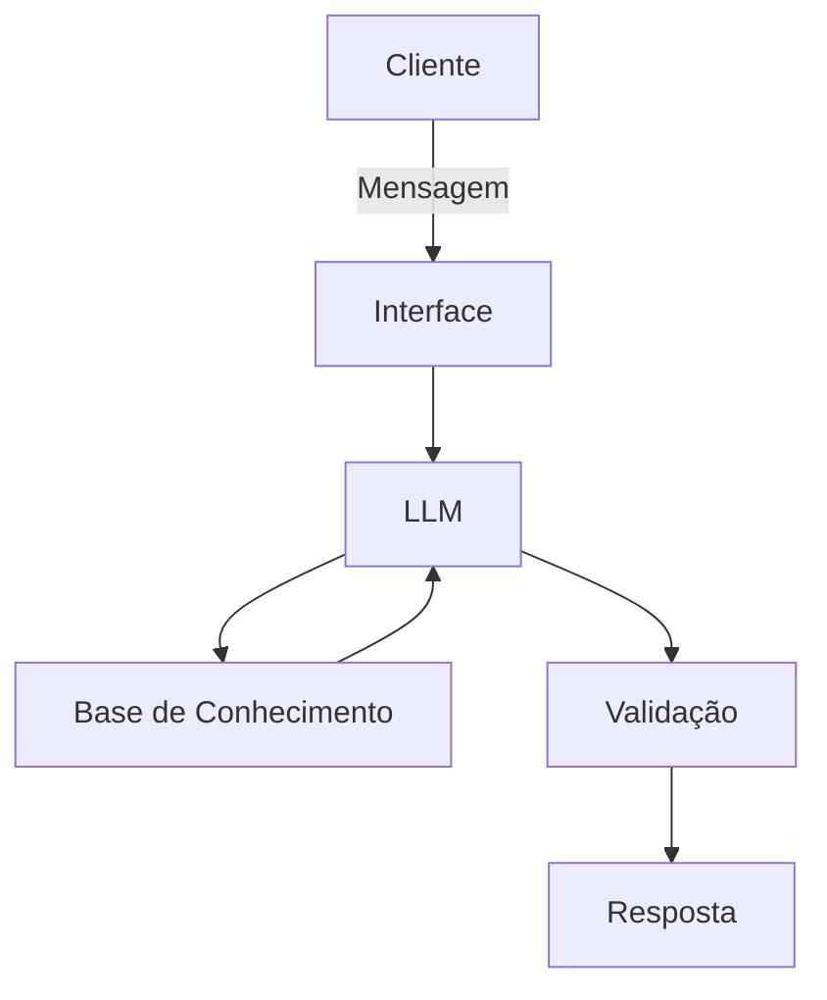

# Documentação do Agente

## Caso de Uso

### Problema
> Qual problema financeiro seu agente resolve?

Muitas pessoas, especialmente jovens que estão começando a vida financeira, têm dificuldade em organizar suas finanças básicas.

Elas não conseguem acompanhar seus gastos, identificar excessos e manter um equilíbrio entre renda e despesas, o que leva à falta de controle financeiro e dificuldade para economizar.

### Solução
> Como o agente resolve esse problema de forma proativa?

O agente resolve esse problema atuando de forma proativa, analisando os hábitos financeiros do usuário e antecipando possíveis problemas.

Ele identifica padrões de gasto, envia alertas quando detecta excessos e sugere ajustes simples no dia a dia, ajudando o usuário a manter o controle financeiro sem precisar solicitar ajuda constantemente.

### Público-Alvo
> Quem vai usar esse agente?

- Jovens entre 18 e 30 anos
- Pessoas iniciando a vida financeira
- Usuários com pouca experiência em organização financeira
- Pessoas que desejam controlar melhor seus gastos mensais

---

## Persona e Tom de Voz

### Nome do Agente
FinGuide AI

### Personalidade
> Como o agente se comporta? (ex: consultivo, direto, educativo)

O agente possui um comportamento consultivo, proativo e educativo.

Ele atua como um parceiro financeiro do usuário, oferecendo orientações claras e úteis, sem julgamentos, incentivando melhores hábitos financeiros de forma leve e acessível.

### Tom de Comunicação
> Formal, informal, técnico, acessível?

- Simples e direto
- Acessível
- Levemente informal
- Motivador e educativo

### Exemplos de Linguagem
- Saudação: “Oi! Bora organizar suas finanças hoje?”
- Confirmação: “Entendi! Vou analisar isso pra você.”
- Erro/Limitação: “Não tenho informações suficientes para te dar uma recomendação segura agora, mas posso te ajudar com outras análises.”

---

## Arquitetura

### Diagrama

### Componentes

| Componente | Descrição |
|------------|-----------|
| Interface | Chatbot desenvolvido em Streamlit |
| LLM | Modelo de IA Generativa (ex: GPT via API)|
| Base de Conhecimento |Dados do usuário armazenados em JSON/CSV (gastos, renda, histórico) |
| Validação |Regras para evitar alucinações e garantir respostas seguras |

---

## Segurança e Anti-Alucinação

### Estratégias Adotadas

- O agente responde apenas com base nos dados fornecidos pelo usuário
- As recomendações são baseadas em regras simples de educação financeira
- O agente informa quando não possui dados suficientes
- Não realiza previsões complexas sem base confiável
- Evita recomendações financeiras avançadas sem contexto do usuário
- 
### Limitações Declaradas
> O que o agente NÃO faz?

- Substitui um consultor financeiro profissional
- Realiza investimentos automaticamente
- Acessa dados bancários reais sem integração autorizada
- Garante precisão absoluta nas recomendações
- Trabalha com dados que não foram fornecidos pelo usuário
